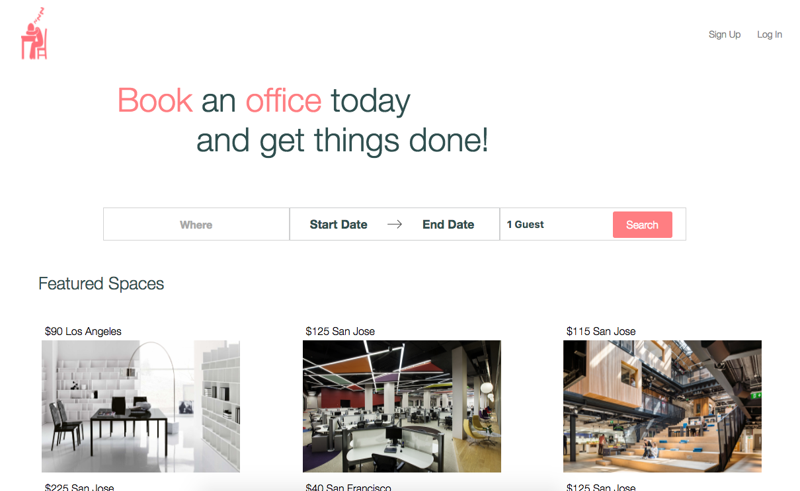
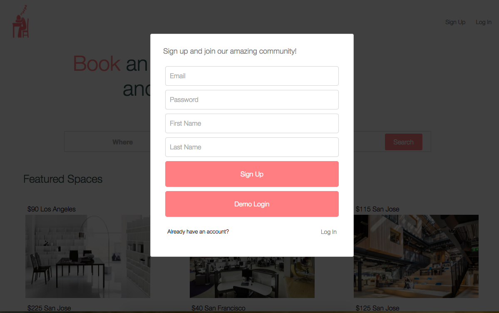
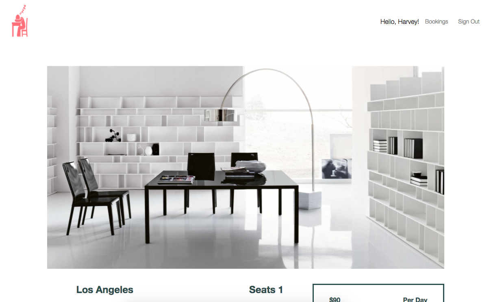
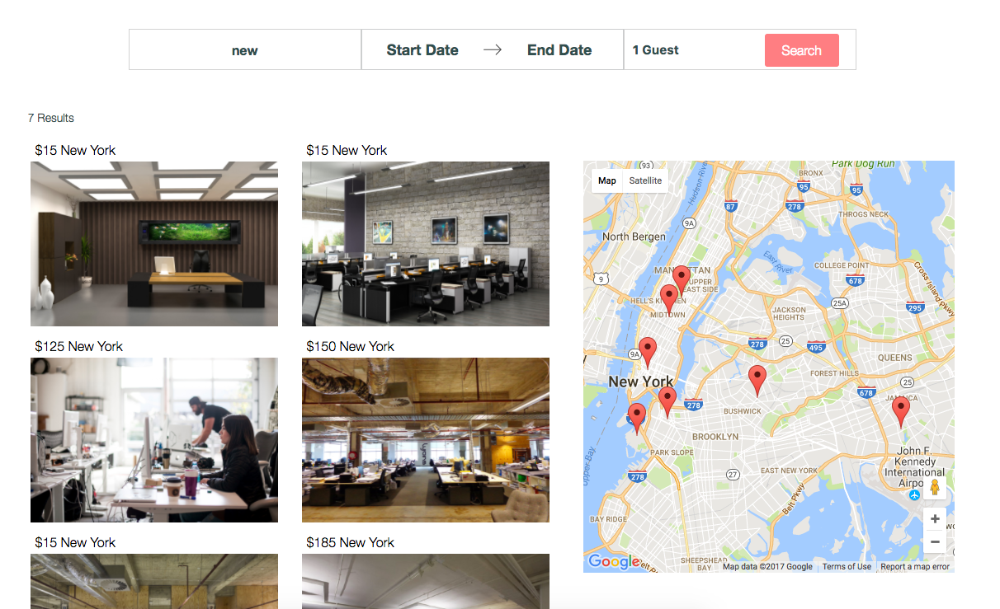
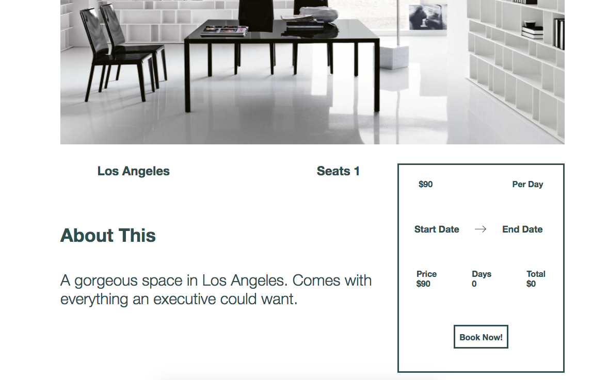
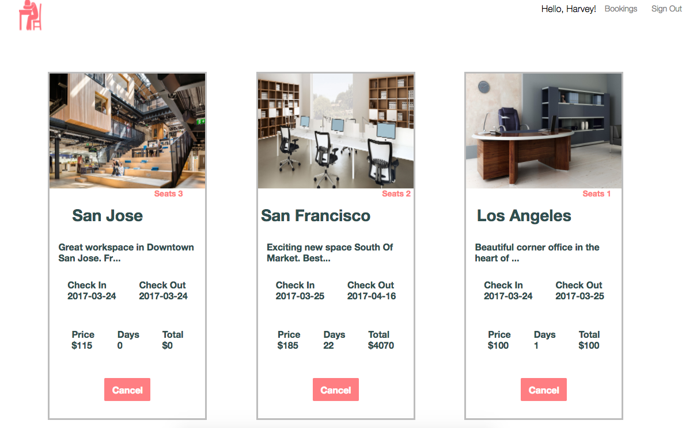
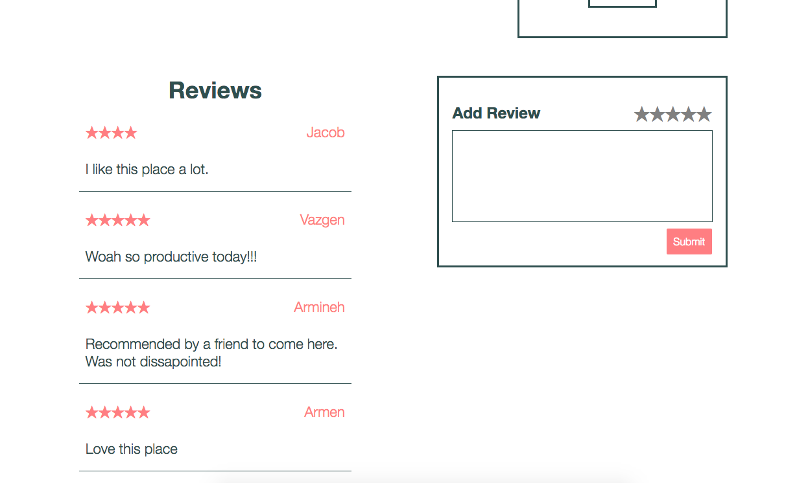

#OfficeBnB
[heroku link][heroku]
[heroku]: https://air-bnb-office.herokuapp.com/#/

Office BnB is a platform to connect you to available office space in your area. It is a web application, inspired by AirBnB, and built using Ruby on Rails on the backend, a PostgresSQL database, and React/Redux framework on the frontend.

##Features and Implementation



###Authentication




User Log In and Sign Up are handled by a modal that will pop up should the user interact with the Header component.

In order to make sure that all user information is kept safe. Passwords are never actually stored in the database. When a user signs up, their password is salted and put through a hashing function from the BCrypt library 10 times. Only the result of that hashing function as well as the added salt is saved in the database as a password digest. When the user tries to log in again, that whole process must be repeated and they will only authenticated if the result of the hashing function matches the password digest that is associated with their email.

```
def password=(password)
  @password = password
  self.password_digest = BCrypt::Password.create(password)
end

def is_password?(password)
  BCrypt::Password.new(self.password_digest).is_password?(password)
end
```

###Offices




On the backend, offices are stored in the database with columns for id, owner_id, location, latitude, longitude, price, image_url, about_this, guest_limit, and desks.

Offices are rendered at / in the Office component. Here they show their image, and location and are a link to the OfficeDetails component.

In the OfficeDetails component, offices are rendered listing all information about the office, including reviews.

Offices are also rendered at /search which makes an API call to fetch offices filtered by availability, price, and location.

###Office Search with google maps



There are two active search bars, one at / and another at /search that allow for location, date entry as well as number of guests. When the search form is submitted on the home page, users are redirected to the search page where their filtered results are available.

At /search, a google map is rendered with markers for each spot whose coordinates lie within the bounds of the map. The map actively filters the rendered spots as the map is moved or zoomed.

###Bookings



Users can book office space by making bookings which are stored in the database. Bookings have columns for user_id, office_id, start_date, and end_date. Bookings are restricted by their availability based on office and dates booked.



Bookings are rendered at /:id/bookings, filtered for the logged in user who can view and cancel their bookings.

###Reviews



Logged in users can leave reviews for offices. Review ratings are input and viewed as stars on the OfficeDetails page. Reviews are stored in the database with a user_id, spot_id, and a body.

Reviews are rendered in the OfficeDetails component, filtered for that office. Filtering information was passed down from the query string. An ajax request was sent, containing this information, to the index action in the reviews controller, which only returned reviews for that specific office.

```
<div className='reviews-and-form'>
  <ReviewContainer office={this.props.routeParams.office_id}/>
  <ReviewFormContainer office={this.props.routeParams.office_id}/>
</div>
```

```
export const fetchReviews = office_id => (
  $.ajax({method: 'GET', url: 'api/reviews', data: {office_id}})
);
```

```
@reviews = Review.where(office_id: params[:office_id])
render 'api/reviews/index'
```
##Future Directions for the Project

In addition to the features already implemented, I plan to continue work on this project. The next steps for OfficeBnB are outlined below.

###Infinite Scroll

Add infinite scroll for bookings, and reviews.

###Direct Messaging

Allow users to send direct messages to the owner of each office and ask questions.
